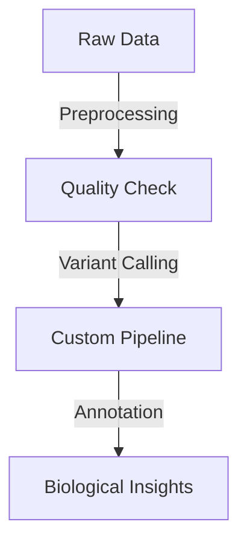

## Hi there my name is Marwa 👋🧬🔬

I am a bioinformatician who likes to work on analyzing Next Generation Sequencing (NGS) data, specifically working with Variant Call Format (VCF) files to identify novel variants associated with neurological diseases, or any other medical condition. 

## 🚀 Languages & Tools:

## 🧬 Bioinformatics Tools

### 🎓 **Background**
I hold a **PhD in Applied Sciences** with a specialization in **biotechnology** and **bioinformatics**. From the American University in Cairo (AUC) **Fall 2024**

Feel free to explore my repositories or connect with me for collaboration opportunities!
